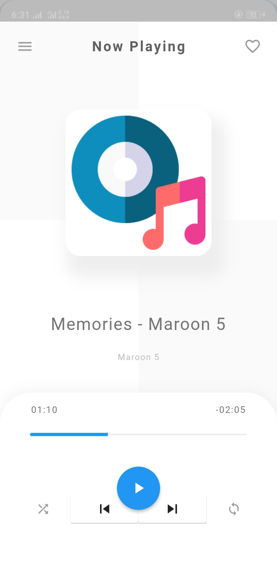
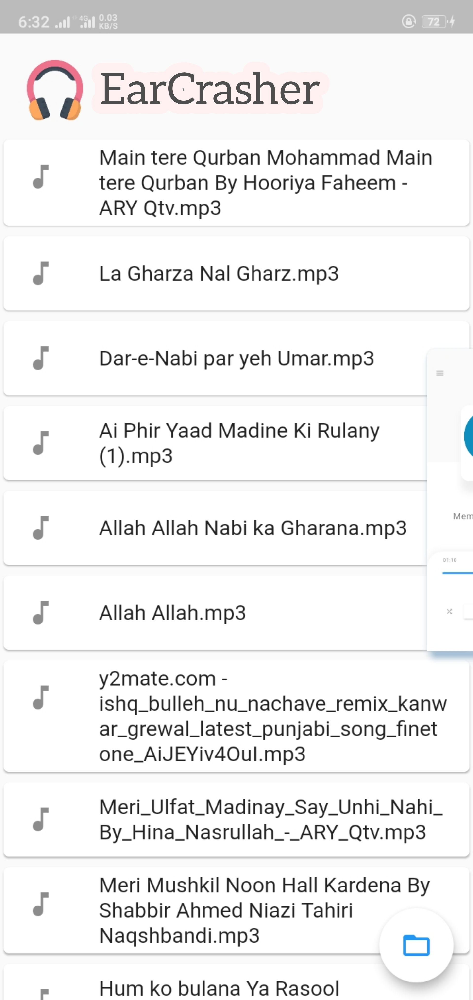
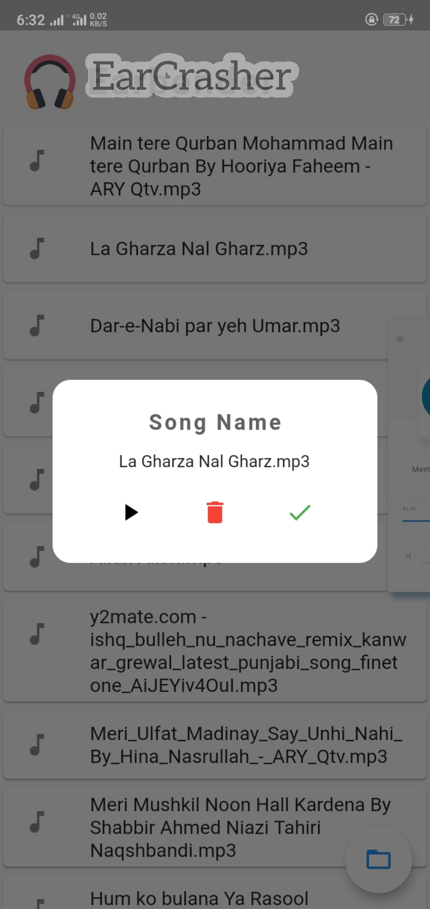
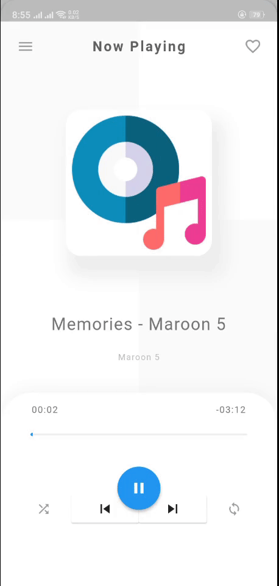

# EarCrasher - Music App

A concept of Music App developed using Flutter. Having functionality of playing Audio.

## ScreenShots
    

### Drawer Concept



### Packages Used

- ```google_fonts: ^1.1.0```
- ```assets_audio_player: ^2.0.7+9```
- ```toast: ^0.1.5```
- ```file_picker: ^1.13.3```

## Author
Connect with me on instagram:Real_dulah_born


#### SURAJ ABUBAKAR
You can also follow my GitHub Profile to stay updated about my latest projects:


If you liked the repo then kindly support it by giving it a star ⭐!

## Contributions Welcome
[](#)

If you find any bug in the code or have any improvements in mind then feel free to generate a pull request.

## Issues

If you face any issue, you can create a new issue in the Issues Tab and I will be glad to help you out.

Copyright (c) 2020 SURAJ ABUBAKAR